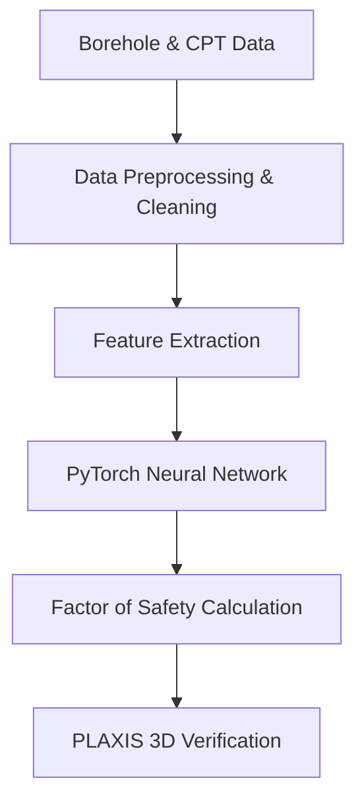

## Executive Summary
Provide a high-level technical overview of the project, highlighting the primary engineering challenge and the computational approach applied.

<!-- OPTIONAL: Live Interactive Demo -->
## Live Interactive Demo
<div class="demo-container" style="margin: 1.5rem 0;">
  <iframe src="[https://demo.example.com](https://demo.example.com)" width="100%" height="450px" style="border: 1px solid var(--border); border-radius: 8px;" loading="lazy"></iframe>
</div>

<!-- OPTIONAL: Theoretical Framework & Equations -->
## Theoretical Framework & Equations
Explain the mathematical foundations and constitutive relations:

$$\tau_{f} = c' + (\sigma_n - u) \tan(\phi')$$

$$FS = \frac{\sum (c' \cdot l + (N - U) \tan \phi')}{\sum W \sin \alpha}$$

<!-- OPTIONAL: Algorithmic Architecture & Workflow -->
## Algorithmic Architecture & Workflow


<!-- OPTIONAL: Implementation & Code Snippet -->
## Implementation & Code Snippet
```python
import numpy as np

def calculate_factor_of_safety(cohesion: float, phi_deg: float, normal_stress: float) -> float:
    """Calculates shear strength using Mohr-Coulomb failure criterion."""
    phi_rad = np.radians(phi_deg)
    return cohesion + (normal_stress * np.tan(phi_rad))
```

<!-- OPTIONAL: Visual Analysis & Video Walkthrough -->
## Visual Analysis & Video Walkthrough

### Model Mesh & FEA Output

*Figure 1: Finite Element mesh discretization and stress field distribution.*

### Demonstration Video
<div class="video-container" style="position: relative; padding-bottom: 56.25%; height: 0; overflow: hidden; margin: 1.5rem 0;">
  <iframe src="[https://www.youtube.com/embed/YOUR_VIDEO_ID](https://www.youtube.com/embed/YOUR_VIDEO_ID)" style="position: absolute; top:0; left:0; width:100%; height:100%; border-radius: 8px; border: 1px solid var(--border);" frameborder="0" allowfullscreen></iframe>
</div>

<!-- OPTIONAL: References & Further Reading -->
---
## References & Further Reading
* **Terzaghi, K., Peck, R. B., & Mesri, G. (1996).** *Soil Mechanics in Engineering Practice* (3rd ed.). John Wiley & Sons.
* **Bentley Systems.** *PLAXIS 3D Reference Manual*. [Documentation Link](https://www.bentley.com)