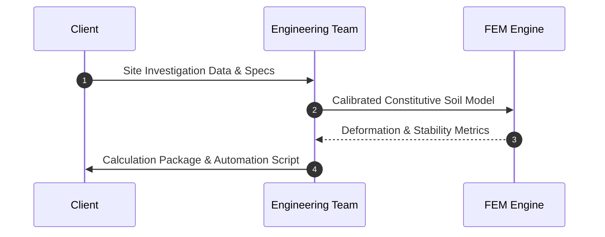

## Service Overview
Detailed description of specialized engineering and computational services provided for infrastructure projects and deep excavations.

<!-- OPTIONAL: Interactive Service Workflow -->
## Interactive Service Workflow


## Capabilities & Technical Deliverables
* **Advanced Numerical Modeling:** 2D/3D Finite Element (FEM) simulations.
* **Automation Scripts:** Custom Python scripts for batch parametric studies.

<!-- OPTIONAL: Technical Implementation & Code Snippet -->
## Implementation & Automation Example
```python
def run_parametric_analysis(mesh_density: int, iterations: int):
    """Automates batch parametric simulations for slope stability."""
    pass
```

<!-- OPTIONAL: Visual Deliverable Preview & Video -->
## Visual Analysis & Media Preview

### Deliverables Preview


### Overview Video
<div class="video-container" style="position: relative; padding-bottom: 56.25%; height: 0; overflow: hidden; margin: 1.5rem 0;">
  <iframe src="[https://www.youtube.com/embed/YOUR_VIDEO_ID](https://www.youtube.com/embed/YOUR_VIDEO_ID)" style="position: absolute; top:0; left:0; width:100%; height:100%; border-radius: 8px; border: 1px solid var(--border);" frameborder="0" allowfullscreen></iframe>
</div>

<!-- OPTIONAL: Standards & Codes Compliance -->
---
## Standards & Codes Compliance
* **Eurocode 7 (EN 1997):** Geotechnical design principles and safety factors.
* **AASHTO LRFD:** Bridge design specifications for subsurface structures.